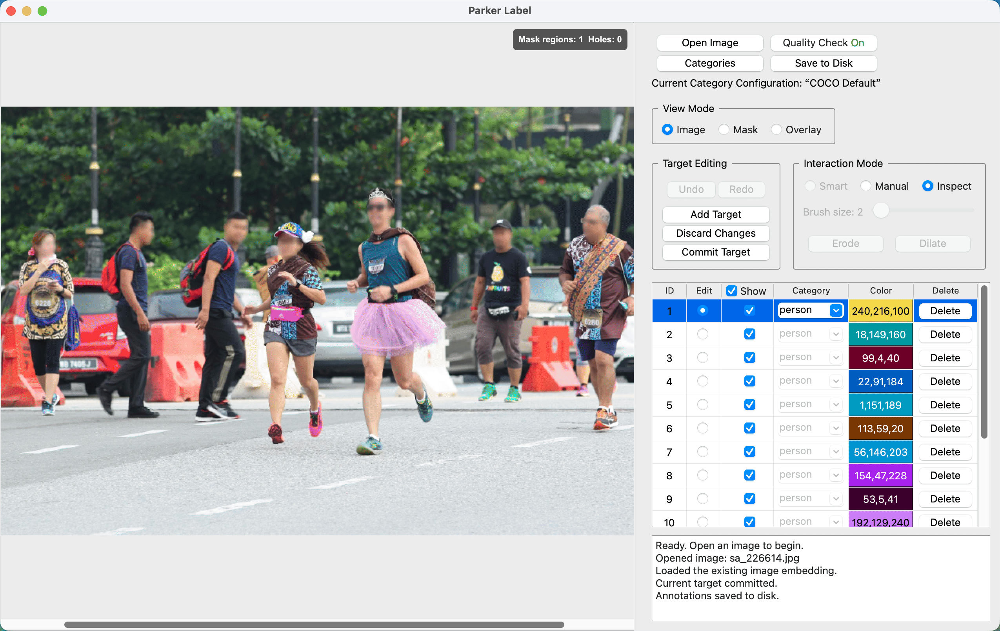

# ParkerLabel

<p align="center">
  
</p>

ParkerLabel is a lightweight, polished **AI-assisted** interactive annotation tool designed for object detection and instance segmentation.

**Runs entirely on the CPU—no GPU required.**

Each interactive mask-decoder inference takes approximately **20 ms** on Apple M5 Pro and Intel Core i9-14900KF CPUs.



## Run

### Download a portable release

Download the portable package for your platform from [GitHub Releases](https://github.com/Parker-Lyu/ParkerLabel/releases) or [Gitee Releases](https://gitee.com/Parker-Lyu/ParkerLabel/releases). Extract the complete archive, then run `ParkerLabel.app` on macOS or `ParkerLabel.exe` on Windows. Python, Conda, and project dependencies are not required.

Keep the extracted program in a writable directory. On startup, ParkerLabel creates `configs/` beside the program. If the required ONNX models are missing or fail integrity verification, it downloads them into `configs/pretrain/`, trying GitHub first and falling back to Gitee. This normally happens only on the first launch; missing, damaged, or incompatible model files are downloaded again. 

The macOS package is ad-hoc signed but is not notarized by Apple. The first launch may therefore be blocked by macOS. After attempting to open the app once, open **System Settings → Privacy & Security**, scroll to the security section, and choose **Open Anyway**.

Portable macOS arm64 and Windows x64 build commands, prerequisites, artifact layouts, OpenCV minimization, and verification steps are maintained in [`builds/SOP.md`](builds/SOP.md).

### Run from source

Install a Conda distribution if you do not already have one. [Miniforge](https://github.com/conda-forge/miniforge) is recommended, but other Conda distributions also work. Open a terminal, then clone the repository, create a Python 3.11 environment, install the dependencies, and start ParkerLabel:

```bash
git clone https://github.com/Parker-Lyu/ParkerLabel.git
cd ParkerLabel
conda create -n parker-label -c conda-forge python=3.11 -y
conda activate parker-label
python -m pip install -r requirements.txt
python main.py
```

ParkerLabel automatically verifies and downloads missing ONNX models into `pretrain/`.

## Overview

ParkerLabel supports 中文（简体）, 中文（繁體）, English, 日本語, 한국어, Deutsch, Français, Italiano, and Español. Use **Settings → Interface Language** to change the interface language and **Settings → Tooltips** to control contextual hints.

Use **Settings → Keyboard Shortcuts** to view, change, clear, or restore key bindings. Smart, Manual, and Inspect modes use `Q`, `W`, and `E` by default. Saved bindings take effect immediately and persist across launches.

### Category configurations

ParkerLabel includes a read-only configuration containing the 80 standard COCO object-detection categories. Users can create an empty category configuration or copy any existing configuration—including the built-in COCO configuration—to create a new version. Saved configurations are immutable; further changes are made by copying a configuration into another version. User-created configurations are stored in `configs/categories/` beside the program.

Each annotation is bound to an exact category configuration by its UUID and SHA-256 digest. If that configuration is missing, does not match, or has been modified outside ParkerLabel, the annotation opens read-only so that its category meanings cannot silently change.

Portable settings, including the startup category selection, are stored in `configs/settings.ini`. The application log is `configs/app.log`; it is cleared on each launch and limited to two 1 MB files while the app runs. Keep the program in a writable directory so it can create `configs/`.

### Annotation files

Each source image uses three neighboring artifact files:

- `.npy` stores the reusable image embedding.
- `.json` stores per-instance category, bounding box, area, and uncompressed COCO RLE at source-image resolution.
- `.mask.png` stores a flattened color preview at source-image resolution. When instances overlap, later instances appear on top. The JSON instance masks remain authoritative.

The per-image JSON uses COCO annotation fields but is not a complete COCO dataset file. A complete COCO dataset export requires top-level `images`, `annotations`, and `categories` arrays in one dataset JSON.

#### JSON fields

- `format` identifies the local annotation schema, currently `parker-label-instance-v2`.
- `category_config_uuid` identifies the exact category configuration bound to the annotation.
- `category_config_sha256` records the digest of that category configuration so unexpected changes can be detected.
- `image` records the image `id`, file name, width, and height.
- `annotations` contains one record per instance.
- `id` is the instance identifier within the image file.
- `image_id` links the instance to the image record.
- `category_id` references a category in the bound category configuration.
- `category_name` keeps the readable category name.
- `color_id` controls the display and preview color.
- `bbox` stores `[x, y, width, height]` in source-image pixels.
- `area` stores the instance pixel area at source-image resolution.
- `iscrowd` follows the COCO crowd flag convention.
- `segmentation` stores the independent instance mask as uncompressed COCO RLE.

## Regenerate ONNX models

**Dependencies:** Install `torch` and `torchvision` using the [PyTorch instructions for your platform](https://pytorch.org/get-started/locally/), then run `python -m pip install timm onnx onnxruntime==1.29.0`. Verified versions: torch 2.13.0, torchvision 0.28.0, timm 1.0.19, onnx 1.22.0, and onnxruntime 1.29.0.

**Checkpoint:** Create `pretrain/`, then download the official [MobileSAM `mobile_sam.pt`](https://github.com/ChaoningZhang/MobileSAM/blob/master/weights/mobile_sam.pt) to `pretrain/mobile_sam.pt`. It is the only weight needed for both exports; no separate TinyViT or SAM checkpoint is required.

**Export:** From the repository root, run:

```bash
python -m mobile_sam.export_mobilesam_encoder --checkpoint pretrain/mobile_sam.pt --output pretrain/encoder.onnx
python -m mobile_sam.export_mobilesam_decoder --checkpoint pretrain/mobile_sam.pt --model-type vit_t --output pretrain/decoder.onnx
```

The application runs the resulting ONNX files. `mobile_sam.pt` and the export dependencies are not needed at runtime. Model files in `pretrain/` are excluded from Git.

## Licenses

ParkerLabel's original code, including `mobile_sam/export_mobilesam_encoder.py`, is licensed under [GPL-3.0-only](LICENSE).

The third-party code in `mobile_sam/` retains its own licenses: [MobileSAM](https://github.com/ChaoningZhang/MobileSAM) and [Segment Anything](https://github.com/facebookresearch/segment-anything) use Apache License 2.0, and the TinyViT code carries a Microsoft MIT notice. See [`mobile_sam/LICENSE`](mobile_sam/LICENSE), [`mobile_sam/TINYVIT_LICENSE`](mobile_sam/TINYVIT_LICENSE), and [`mobile_sam/THIRD_PARTY.md`](mobile_sam/THIRD_PARTY.md) for the license texts and attribution.

The GUI uses PyQt5 and Qt under their own licenses. Exact final-package notices, corresponding-source instructions, and Qt replacement instructions are maintained in [`third_party_licenses/`](third_party_licenses/). Model source and export provenance are recorded in [`docs/model-provenance.md`](docs/model-provenance.md), and the release audit procedure is in [`docs/release-licenses.md`](docs/release-licenses.md).

## Acknowledgements

ParkerLabel's AI-assisted segmentation workflow is built on the work of:

- [MobileSAM](https://github.com/ChaoningZhang/MobileSAM), a lightweight Segment Anything model designed for resource-efficient inference.
- [Segment Anything](https://github.com/facebookresearch/segment-anything), the original segmentation model and framework developed by Meta AI.

We thank the authors and contributors of both projects for making their work publicly available.
